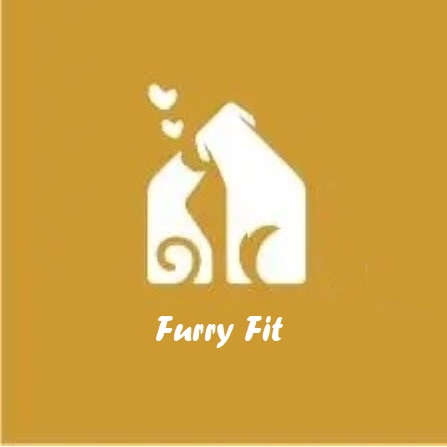

<div align="center">



# <strong>SIT725-GroupProject-Furry kit</strong>

</div>

[](https://github.com/DongqiShen96/Sit725-GroupProject)

## <strong>Description</strong>

### Pet management web application

Our software will assist pet owners in managing and generating daily activity schedules. Users can easily generate a daily schedule of their pet's activities through our web application, and they can also add and modify their schedules. Additionally, users can calculate whether their pets are in a healthy state by inputting their weight and height. This also allows users to track their pets' health status and modify their daily activities accordingly.

## <strong>Table of Contents</strong>

- [Features](#features)
- [Usage](#usage)
- [Technology Stack](#technology-stack)
- [Maintainers](#maintainers)
- [License](#license)

## <strong>Features</strong>

### User Management

- Users can create accounts and log in with credentials.
- Our application prevents unauthorized access and ensures data privacy.
- Users can view and update their information and pet information on the personal information page.

### Daily Activity Schedules

- Users can create, modify and manage their pet's daily activity schedule.
- Our application provides a user-friendly interface for users to easily add and edit activities.
- Our application allow users to track changes in their pet's health status over time.
- Our application provides notifications of upcoming activities.

### Health Tracking

- Users can enter their pet's weight and height for health tracking.
- Our application calculates whether the pet is in a healthy state based on the entered data.
- Our application provides a visual representation of the pet's health status.
- Users can track changes in their pet's health status over time.

## <strong>Usage</strong>

### 1. Clone the repository:

```bash
git clone https://github.com/DongqiShen96/SIT725-GroupProject.git
```

### 2. Navigate to the project directory:

```
cd SIT725-GroupProject
```

### 3. Install dependencies:

```
npm install bcryptjs express mongodb request socket.io
```

## <strong>Running the application</strong>

To start the web application, run the following command in your terminal:

```
npm start
```

This will start the server at http://localhost:3000.

### <strong> Use Instructions</strong>

<li>Login PAGE 
<ul>
<li>On the LOGIN page, <strong>Log in</strong> with your <strong>email</strong> and <strong>password</strong></li>
<li>
If you don't have an account, click <strong>Create Your Account</strong>, enter your <strong>email</strong> and <strong>password</strong> and click <strong>Create</strong> to register your account.
</ul></li>
<li>
Main PAGE
<ul>
<li>Click the <strong>ADD EVENT</strong> button on the main page and enter the <strong>time</strong> and <strong>event</strong> to create your pet's event. After creating an event, you can delete it by <strong>Delete</strong> and modify it by <strong>Edit</strong>.
</li><li>
Access the health management page via <strong>Health Track</strong> in the navigation bar
</li><li>
Go to the team introduction page via <strong>About Us</strong> in the header bar
</li><li>
Enter the user/pet information page through <strong>User</strong> in the navigation
</li><li>
Click on the  <strong>logo </strong> in the upper left corner and  <strong>Schedule </strong> in the navigation bar to return to the main page
</li>
</ul></li>
<li>Health Track PAGE 
<ul>
<li>On this page you can click <strong>Calculate</strong> to open a form to enter <strong>Weight</strong> and <strong>Height</strong> to calculate the health status for your pet.</li>
<li>
In History, you can check your pet's health status over time by clicking <strong>Search</strong>
</ul></li>
<li>User/Pet information PAGE 
<ul>
<li>On this page you can view your personal information and modify it by clicking on <strong>Edit</strong> in the user information form</li>
<li>
Similarly, you can modify your pet's information by clicking on the <strong>Edit</strong> button in the pet information form
</ul></li>

## <strong>Technology Stack</strong>

- HTML
- CSS
- JavaScript
- MongoDB

### Dependencies

- express@4.18.2
- bcryptjs@2.4.3
- mongodb@4.4.1
- request@2.88.2
- socket.io@4.6.1

## <strong>Maintainers</strong>

[@ENDER SHEN](https://github.com/DongqiShen96), [@TIM ZHENG](https://github.com/FradAlfTim), [@TRUNG MINH TRAN](https://github.com/tmtrungg), [@ROY CHEN](https://github.com/Nightcatclub)

## <strong>License</strong>

ISC © 2023 SIT-725-team-6
